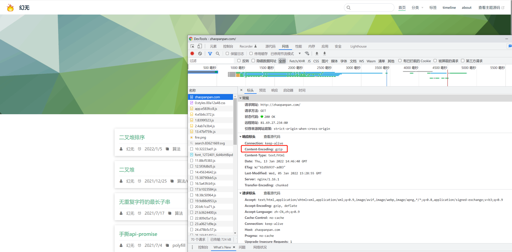
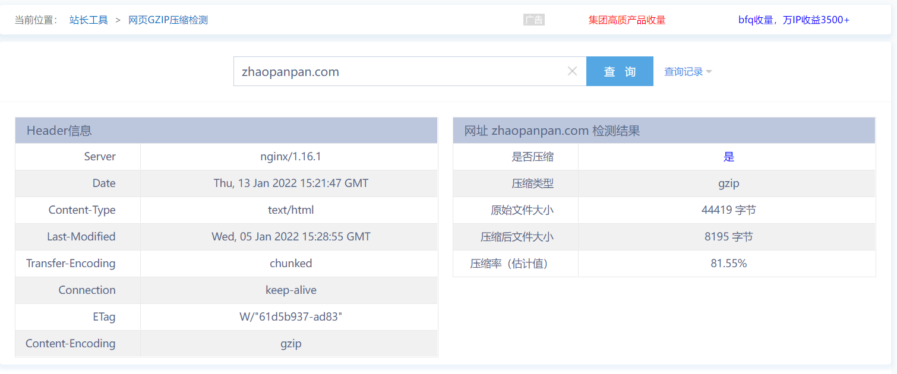
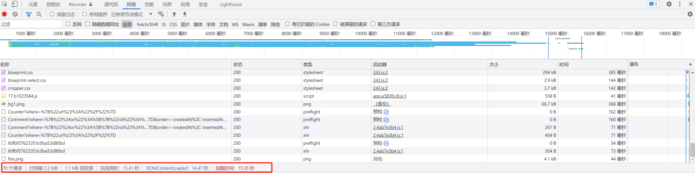
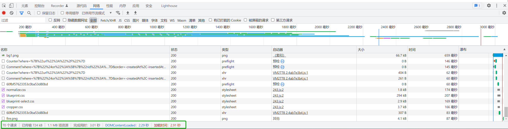

### Gzip压缩是啥呢？

from [CDN](https://developer.mozilla.org/zh-CN/docs/Glossary/GZip_compression):

::: tip
Gzip 是一种用于文件压缩与解压缩的文件格式。它基于 Deflate 算法，可将文件（译者注：快速地、流式地）压缩地更小，从而实现更快的网络传输。 Web服务器与现代浏览器普遍地支持 Gzip，这意味着服务器可以在发送文件之前自动使用 Gzip 压缩文件，而浏览器可以在接收文件时自行解压缩文件。
:::

简而言之就是开启以后会将输出到用户浏览器的数据进行压缩的处理，这样就会减小通过网络传输的数据量，提高浏览的速度，也节约了网站流量

### Nginx 的 Gzip

Nginx 内置了 ngx_http_gzip_module 模块，该模块会拦截请求，并对需要做 Gzip 压缩的文件做压缩。因为是内部集成，所以我们只用修改 Nginx 的配置，就可以直接开启。

```shell
# 登陆服务器
ssh -v root@8.147.xxx.xxx

# 进入 Nginx 目录
cd /etc/nginx

# 修改 Nginx 配置
vim nginx.conf
```

#### 在 server 中添加 Gzip 压缩相关配置：

```shell
    server {
        listen       80 default_server;
        listen       [::]:80 default_server;
        server_name  _;         #域名：www.example.com 这里 "_" 代表获取匹配所有
        include /etc/nginx/default.d/*.conf;

        location / {
                root /home/www/blog;
                index index.html index.htm;
        }

        # gzip 配置
        gzip on;
        gzip_min_length 1k;
        gzip_comp_level 6;
        gzip_types application/atom+xml application/geo+json application/javascript application/x-javascript application/json application/ld+json application/manifest+json application/rdf+xml application/rss+xml application/xhtml+xml application/xml font/eot font/otf font/ttf image/svg+xml text/css text/javascript text/plain text/xml;

        error_page 404 /404.html;
        location = /404.html {
        }

        error_page 500 502 503 504 /50x.html;
        location = /50x.html {
        }
    }
```

#### gzip 配置解释:  

1、gzip ：是否开启 gzip 模块 on 表示开启 off 表示关闭，默认是 off  
2、gzip_min_length：设置压缩的最小文件大小，小于该设置值的文件将不会压缩  
3、gzip_comp_level：压缩级别，从 1 到 9，默认 1，数字越大压缩效果越好，但也会越占用 CPU 时间，这里选了一个常见的折中值  
4、gzip_types：进行压缩的文件类型

#### 记得重启nginx

```shell
nginx -s reload
```

### 看看成功没

打开控制台看请求



用站长之家也可以看到



### 提升性能如何?

开启前



开启后



可以看到，完成用时直接从之前的 `15.41s` 降到 `3.01s` , 传输文件大小从 `2.2M` 降到 `724kb` , 相当于五倍速度的提升，嗯~真香！
