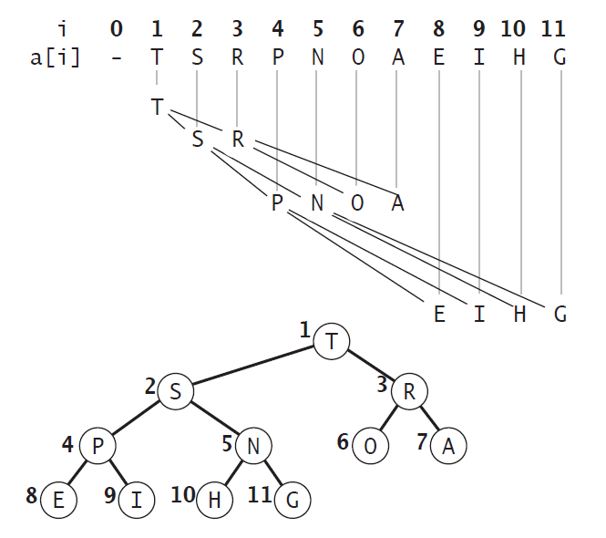

最近在研究react的调度部分源码，有用到[二叉堆](https://github.com/facebook/react/blob/main/packages/scheduler/src/SchedulerMinHeap.js)这个数据结构来实现的调度相关功能，今天就温习一下二叉堆吧

## 定义和特性

二叉堆是一种特殊的二叉树，能高效、快速地找出最大值和最小值，常被应用于优先队列，也被用于著名的堆排序算法中，它有两个特性：
 *  结构特性：它是一棵完全二叉树，表示树的每一层都有左侧和右侧子节点（除了最后一层的叶节点），并且最后一层的叶节点尽可能都是左侧子节点。
 *  堆特性：二叉堆不是最小堆就是最大堆。最小堆允许你快速提取树的最小值，最大堆允许你快速提取树的最大值。所有的节点都大于等于（最大堆）或小于等于（最小堆）每个它的子节点。

> 最大堆：父结点的键值总是大于或等于任何一个子节点的键值
>  
> 最小堆：父结点的键值总是小于或等于任何一个子节点的键值

## 二叉堆表示法：

 二叉堆是个完全二叉树，所以可以使用数组结构来实现，如果根节点在数组中的位置是1，如下图所示，位置 k 的节点的父节点的位置为 [k/2]，而它的两个子节点的位置则分别为 2k 和 2k+1。
 这样通过计算数组的索引在就可以在树中上下移动：从 a[k] 向上一层就令 k 等于 k/2，向下一层则令 k 等于 2k 或 2k+1。这里们以根节点在数组中位置是1的情况为例，这种基于1的数组存储方式便于寻找父节点和子节点。

 如果存储数组的下标基于0，那么下标为i的节点的子节点是2i+ 1与2i+ 2；其父节点的下标是⌊floor((i− 1) ∕ 2)⌋。函数floor(x)的功能是“向下取整”，或者说“向下舍入”，即取不大于x的最大整数（与“四舍五入”不同，向下取整是直接取按照数轴上最接近要求值的左边值，即不大于要求值的最大的那个值）。比如floor(1.1)、floor(1.9)都返回1

## 插入

插入最简单，主要就两步:

* 向二叉堆尾部添加新元素
* 执行上浮操作(一般插入操作可能会破环整个数据结构的有序性，这时需要和父级节点做对比，判断是否需要换位置，重复执行对比，一直到满足有序性)

## 删除

取出根节点的值对比插入稍微复杂一点，归纳起来可以分为三步:

* 取出根节点的值
* 将最后一个元素与根节点进行替换，并删除最后一个元素
* 下沉

## 结语

定义理解起来还是比较简单的，本质上是一个 `特殊的二叉树` ，不过记忆文字定义总是不靠谱的，后面根据示例代码再干一遍吧
