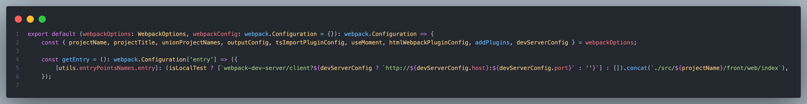
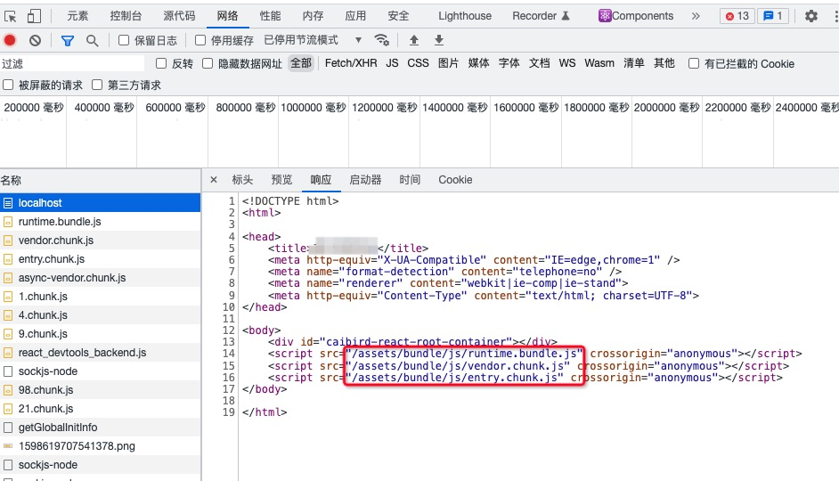
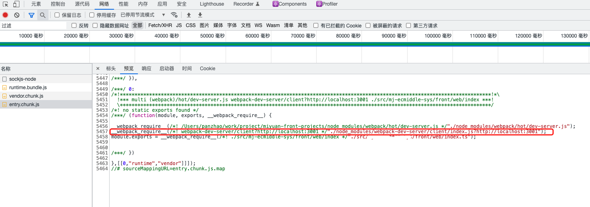

[pre]:./%E7%BB%99%E5%85%AC%E5%8F%B8%E9%A1%B9%E7%9B%AE%E5%8A%A0%E4%B8%8A%E7%83%AD%E6%9B%B4%E6%96%B0%E5%8A%9F%E8%83%BD.md

## 背景

[上一篇][pre]主要是为了解决热更新的问题，通过解决问题，有引申出了另一个问题，就是webpack-dev-server是如何建立webSocket连接呢？

## socket地址是如何生成的呢？

从配置开始看，有个很重要的点，在webpack的配置参数里面 `entry` , 对于启用热更新是很重要的，[官方文档的指南](https://webpack.docschina.org/guides/hot-module-replacement/#enabling-hmr)里面就有，其实[上一篇][pre]的端口错误也就是影响到这里的配置了，正常情况应该是 `webpack-dev-server/client?http://localhost:3001` ， 我们会在输出文件里面可以看到它的踪影，后面再说



这里要有两个概念，一个是服务端，一个是客户端，服务端就是项目webpack自带的 `wds` (有些项目自研脚手架里面自己搭建node服务，用到 `webpack-dev-middleware` ，其实 `wds` 也是依赖 `wdm` )，就是我们的开发者服务，watch文件变化、和客户端通信、代理请求、自动打开浏览器等等功能后依赖他完成，客户端是我们的浏览器端，项目启动， `webpack` 在编译完成后，会启动 `wds` 服务，看源码吧

> node_modules/webpack-dev-server/lib/Server.js line:72

```js
class Server {
    constructor(compiler, options = {}, _log) {
        ...

        updateCompiler(this.compiler, this.options);

        ...
    }
```

在初始化的时候会调用上面的 `updateCompiler` 方法，这个方法里面会传入webpack编译后的 `compiler` 对象, 

> node_modules/webpack-dev-server/lib/utils/updateCompiler.js 

```js
function updateCompiler(compiler, options) {
    ...

    // line:48-57
    addEntries(webpackConfig, options);
    compilers.forEach((compiler) => {
        const config = compiler.options;
        compiler.hooks.entryOption.call(config.context, config.entry);

        const providePlugin = new webpack.ProvidePlugin({
            __webpack_dev_server_client__: getSocketClientPath(options),
        });
        providePlugin.apply(compiler);
    });

    ...
}
```

通过 `addEntries` 修改的 `entry` 配置, 并把 `webpack-dev-server/client/index.js` 添加到 `entry` 配置中，然后调用 `compiler.hooks.entryOption.call(config.context, config.entry);` 使之生效，
这里面还有个很重要的点就是调用了 `webpack.ProvidePlugin()` 方法，向webpack注入了 `__webpack_dev_server_client__` , 类似于全局变量，这个变量名是用来引用 `webpack-dev-server/client/clients/WebsocketClient.js` 的，有木有很眼熟，对，就是上面实例化websocket报错的那个文件



wds拉起浏览器，让浏览器请求 `http://localhost:3001/`

可以看到html里面会加载三个bundle，前两个是根据splitChunks配置生成的， `entry.bundle.js` 是根据 `entry` 配置生成的

* `runtime.bundle.js` 是webpack的引导程序，管理着各个chunk，
* `vender.chunk.js` 是项目打包后node_modules代码
* `entry.bundle.js` 主要是项目代码， 



  
`entry.bundle.js` 中除了项目代码还有新发现，webpack在通过 `__webpack_require__` 来引入 `client.js` , 而 `webpack-dev-server/client/index.js?http://localhost:3001"` , 这个路径就是上面配置的entry啊，这就解释了webpack是如何把 `client.js` 导入到浏览器端的，有了 `client.js` ，浏览器才算是真正的客户端，才可以通过websocket和wds进行交互，下面看看 `client.js`

### 客户端代码--client.js

`createSocketUrl` , 终于看到url的庐山真面目了，这个方法就是用来生成websocket的url的，这里有个新名词[__resourceQuery](https://webpack.docschina.org/api/module-variables/#__resourcequery-webpack-specific)，他是webpack的一个全局变量，当引入当前文件时， `__resourceQuery=?http://localhost:3001` ，所以[上一篇][pre]端口错误的就是影响到这里正确生成url了, ? 后面的参数也只是给 `webpack-dev-server/client/index.js` 传参而已，至于 `createSocketUrl` 方法也只是校验协议、端口、地址等信息，最后返回一个合法的url。

> node_modules/webpack-dev-server/client/index.js

```js
...
var socket = require('./socket');

// line:20
var createSocketUrl = require('./utils/createSocketUrl');
...
// line:35
var socketUrl = createSocketUrl(__resourceQuery);

...

// line:176
socket(socketUrl, onSocketMessage);
```

## 连接webSocket--socket.js

上面拿到url之后，会调用 `socket` 方法，这里就是连接webSocket的地方，首先会拿到 `Client` , 这里会发现一个熟悉的面孔 `__webpack_dev_server_client__` ，这就对应上了上面的 `updateCompiler` 文件对应上了，会拿到之前注入的客户端文件，然后进行实例化操作
到此为止，如果地址没有问题，那webSocket也就可以正常工作了

> node_modules/webpack-dev-server/client/socket.js

```js
var Client = typeof __webpack_dev_server_client__ !== 'undefined' ? __webpack_dev_server_client__ : // eslint-disable-next-line import/no-unresolved
    require('./clients/SockJSClient');
var retries = 0;
var client = null;

var socket = function initSocket(url, handlers) {
    client = new Client(url);
    client.onOpen(function() {
        retries = 0;
    });
    client.onClose(function() {});
    client.onMessage(function(data) {
        var msg = JSON.parse(data);

        if (handlers[msg.type]) {
            handlers[msg.type](msg.data);
        }
    });
};

module.exports = socket;
```

## 总结
